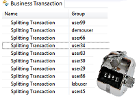

## Business-Transaction-Row-Counter-Plugin

The Business Transaction Row Count plugin queries a Business Transaction Dashboard to return the number of rows/splittings in the table.  
The plugin supports both HTTP and HTTPS.

Find further information in the [dynaTrace community](https://community.dynatrace.com/community/display/DL/Business+Transaction+Row+Counter+Plugin)
